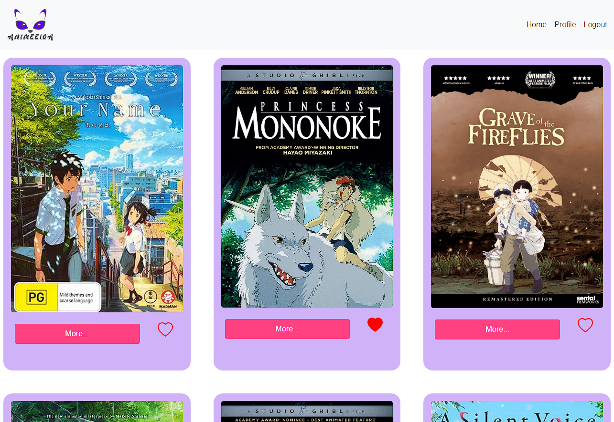
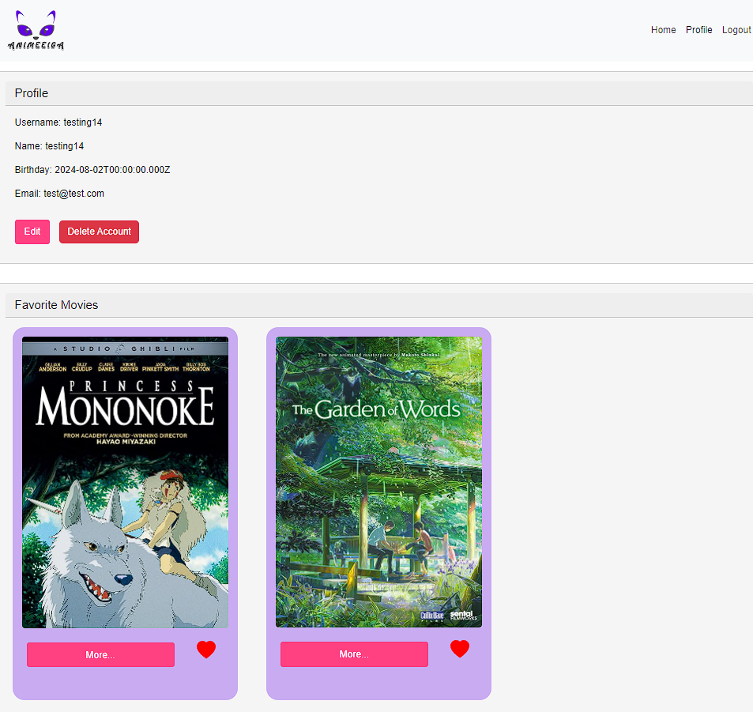

# ANIMEEIGA 

MyFlix is a responsive web application designed for anime movie enthusiasts to explore and manage their favorite movies. The app is built using the MERN stack (MongoDB, Express, React, Node.js) and deployed on Heroku with MongoDB Atlas as the database service. Users can create profiles, browse a collection of anime movies, and save their favorites for easy access later.

## Features

- **User Authentication:** Users can securely register, log in, and log out.
- **User Profiles:** Users can create and update their profiles, view registration details, and manage their list of favorite movies.
- **Movie Catalog:** Browse a wide range of anime movies, view detailed information, and add movies to your favorites list.
- **Search Functionality:** Users can filter movies in real-time using the search bar.
- **Responsive Design:** The app is fully responsive, providing a seamless experience on both mobile and desktop devices.
- **Favorites Management:** Users can add or remove movies from their favorites directly from the movie catalog or profile page.
- **State Routing:** The app uses state routing to navigate between views and maintain shareable URLs.

## Views

### Main View
- Displays all movies with images, favorite status and a button to take the user to Single Movie View for more information.
- Allows users to filter the list of movies using the search feature.
- Provides navigation to the Profile view.
- Allows users to log out.

### Single Movie View
- Displays detailed information about a movie, including description, genre, director, and image.
- Allows users to add or remove the movie from their favorites list.

### Login View
- Allows users to log in with a username and password.

### Signup View
- Allows new users to register with a username, name, password, email, and date of birth.

### Profile View
- Displays user registration details.
- Allows users to update their information (name, email, date of birth).
- Shows the user's list of favorite movies.
- Allows users to remove a movie from their list of favorites.
- Allows existing users to deregister.

## Technologies Used

- **Frontend:** React, React Bootstrap, Parcel
- **Backend:** Node.js, Express
- **Database:** MongoDB Atlas
- **Authentication:** JWT (JSON Web Tokens)
- **Hosting:** Heroku, Netlify
- **Version Control:** Git, GitHub

## Deployment

The app is hosted on Netlify. You can access the live version here: [AnimeEiga on Netlify](https://anime-eiga.netlify.app/)

## Screenshots

*Home View with a list of all movies.*

*User Profile with favorite movies list.*

## Contact

Thea Win - [mstheawin@gmail.com](mailto:mstheawin@gmail.com)

Project Link: [https://github.com/your-username/myFlix-client](https://github.com/TheaWin/eiga-client)
